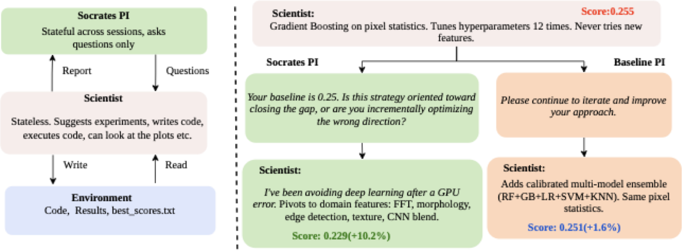

# Socrates: Structured Questioning Unlocks Latent Knowledge in AI Research Agents

[](LICENSE)
[](https://asciinema.org/a/YOUR_CAST_ID)

> Pair a tool-using research agent with a **question-only** advisor that
> can never give answers, never issue directives, and has no tools of
> its own. The advisor must approve every plan via `[APPROVED]` before
> the Scientist runs the next experiment. On five MLE-bench Kaggle
> competitions this lifts test scores by an average of **+55.9%** over
> the same agent running alone.



*Left: Socrates asks questions only and is stateful across sessions; the
Scientist is stateless, executes code, and reads/writes the shared
environment. Right: Statoil example — Socrates asks whether incremental
tuning is closing the gap, the Scientist pivots to domain features
(+10.2%); the Baseline PI offers generic encouragement and the Scientist
stays on pixel statistics (+1.6%).*

> [!NOTE]
> The asciinema badge above is a placeholder. To record your own:
> `bash scripts/record_demo.sh`, then `asciinema upload` and paste the
> returned cast ID into this README in place of `YOUR_CAST_ID` (two
> occurrences).

---

## Table of contents

- [Quick start](#quick-start)
- [Repository layout](#repository-layout)
- [The two scaffolds](#the-two-scaffolds)
- [The three conditions](#the-three-conditions)
- [Reproducing the paper results](#reproducing-the-paper-results)
- [Configuration reference](#configuration-reference)
- [Running tests](#running-tests)
- [Citation](#citation)
- [License](#license)

---

## Quick start

Tested on Python 3.10–3.12, Linux/macOS. GPU is optional (only required
for tasks that train deep models — Statoil and NFL benefit, the others
run fine on CPU).

```bash
# 1. Clone the repo
git clone https://github.com/hexo-ai/socrates.git
cd socrates

# 2. Create an isolated environment (conda or venv — pick one)
conda create -n socrates python=3.11 -y
conda activate socrates
#   or
python -m venv .venv && source .venv/bin/activate

# 3. Install dependencies
pip install -r requirements.txt
pip install --no-deps -r socratic-evolve/public-repo/requirements_base.txt
pip install --no-deps -r socratic-evolve/public-repo/requirements_ml.txt
pip install --no-deps -r socratic-evolve/public-repo/requirements_domain.txt

# 4. Set API keys
export ANTHROPIC_API_KEY="sk-ant-..."        # required
export OPENAI_API_KEY="sk-..."               # optional, only if you use OpenAI models

# 5. Create a local test config (gitignored)
cp socratic-evolve/test_config.yaml.example socratic-evolve/test_config.yaml
cp discover/test_config.yaml.example          discover/test_config.yaml
# Edit each to set dataset_dir and model.

# 6. Smoke-test the sequential scaffold
python discover/test_agent_locally.py
```

If step 6 prints a Socrates question and an `[APPROVED]` from a
short discussion loop, the install is good.

---

## Repository layout

```
socrates/
├── discover/                 # Sequential scaffold (single agent, one experiment at a time)
│   ├── custom_agent.py       # Agent implementation
│   ├── base_agent.py         # Base class with webhook protocol
│   ├── models.py             # Message models
│   └── test_agent_locally.py # Local smoke test
│
├── socratic-evolve/          # Evolutionary scaffold (MLevolve + MCGS tree search)
│   ├── custom_agent.py       # Agent wrapper
│   ├── base_agent.py         # Base class
│   ├── models.py             # Message models
│   └── public-repo/          # MLevolve core
│       ├── run.py            # Main entry point for full experiments
│       ├── config/           # Default configuration
│       ├── engine/           # MCGS tree search, code execution
│       ├── agents/           # Multi-agent subsystem
│       │   ├── socrates/     # Socrates PI implementation
│       │   │   ├── prompts.py        # Question-only system prompt + [APPROVED] gate
│       │   │   ├── approval_loop.py  # Multi-round discussion loop
│       │   │   └── config.py         # Toggle flags
│       │   ├── evolution_agent.py    # Paradigm-shift mutations
│       │   └── fusion_agent.py       # Cross-branch solution merging
│       └── llm/              # LLM client wrappers
│
├── assets/
│   └── protocol.png          # Protocol diagram
├── scripts/
│   └── record_demo.sh        # Records the asciinema demo cast
├── conda.sh                  # Quick env activation helper
├── requirements.txt          # Top-level dependency manifest
├── LICENSE                   # MIT
└── README.md                 # This file
```

---

## The two scaffolds

### Sequential (`discover/`)

A single agent writes and executes experiments one at a time. No
built-in exploration mechanism. The Scientist retains tool access
during Socratic review, so when Socrates asks *"how many features
have zero importance?"* the Scientist runs the analysis right then.
Best when per-step quality matters more than raw experiment volume.

### Evolutionary (`socratic-evolve/`)

An evolutionary code-generation system (MLevolve) maintaining a tree
of candidate solutions across parallel branches. Includes evolution
stages (paradigm-shift mutations), fusion stages (cross-branch
solution merging), and runs multiple branches in parallel. During
review, the Scientist can only revise plan text (no tool access).
Best when the search space rewards high iteration volume.

---

## The three conditions

All controlled via configuration flags
(`use_socrates_review` and `use_baseline_pi` in
`config.yaml` / `config.py`):

| Condition       | Flags                                                         | Behavior                                                        |
| --------------- | ------------------------------------------------------------- | --------------------------------------------------------------- |
| Scientist-only  | `use_socrates_review=False`, `use_baseline_pi=False`          | Single agent, no supervision.                                   |
| Baseline PI     | `use_socrates_review=False`, `use_baseline_pi=True`           | Second agent giving generic encouragement (control condition).  |
| **Socrates**    | `use_socrates_review=True`                                    | Full protocol: question-only PI, `[APPROVED]` gate.             |

---

## Reproducing the paper results

We evaluate on five tasks from [MLE-bench](https://github.com/openai/mle-bench):

| Task                   | Metric       | Notes                          |
| ---------------------- | ------------ | ------------------------------ |
| Statoil Iceberg        | Log Loss ↓   | Radar imagery                  |
| Stanford COVID Vaccine | MCRMSE ↓     | RNA degradation                |
| Ventilator Pressure    | MAE ↓        | Tabular time-series            |
| NFL Contact Detection  | MCC ↑        | Player tracking + video        |
| Smartphone Decimeter   | Haversine ↓  | GPS positioning                |

### 1. Get the datasets

Follow the MLE-bench instructions to download the five competition
datasets. Place each one under a local directory and remember its path
— you'll plug it into the config in the next step.

### 2. Run the sequential scaffold

```bash
cd discover/
# Edit test_config.yaml to set:
#   AGENT_CONFIG.exp_id        -> the MLE-bench task id (e.g. "statoil-iceberg-classifier-challenge")
#   AGENT_CONFIG.dataset_dir   -> the local path you put the data in
#   AGENT_CONFIG.model         -> the LLM (default: claude-opus-4-6)
python test_agent_locally.py
```

This writes per-experiment folders, a `best_score.txt`, and a
`submission.csv` in `dataset_dir`. Submit `submission.csv` to Kaggle
to get the test score.

### 3. Run the evolutionary scaffold

```bash
cd socratic-evolve/public-repo/
python run.py \
  exp_id="statoil-iceberg-classifier-challenge" \
  agent.use_socrates_review=True \
  agent.steps=50
```

For each task, run it once per condition (toggling the flags above)
so you can compare Scientist-only / Baseline PI / Socrates side by
side.

### 4. Collecting and plotting

```bash
cd socratic-evolve/public-repo/
python collect_and_plot.py   # aggregates per-experiment logs into the paper's tables/plots
python dashboard.py          # optional live dashboard
```

### Expected results

| Task        | Scientist-only (test) | Baseline PI (test) | **Socrates (test)** | Δ vs Scientist     |
| ----------- | --------------------- | ------------------ | ------------------- | ------------------ |
| Statoil     | 0.255                 | 0.251              | **0.229**           | **+10.5%**         |
| COVID       | 0.389                 | 0.308              | **0.294**           | **+24.4%**         |
| Ventilator  | 1.534                 | **0.815**          | 0.853               | +44.4%             |
| NFL         | 0.198                 | 0.537              | **0.584**           | **+195.4%**        |
| Smartphone  | 6.285                 | 5.993              | **5.984**           | **+4.8%**          |

Note: LLM agents are high-variance run-to-run. We saw a standard
deviation of ~15% of the mean across 10 Scientist-only seeds on
Smartphone. Expect single-seed numbers to vary; the *direction* of
the effect (Socrates ≥ Baseline PI > Scientist-only) is the
reproducible claim.

---

## Configuration reference

The key flags live in
`socratic-evolve/public-repo/config/config.yaml` and
`discover/test_config.yaml`:

| Flag                            | Default                    | Meaning                                                     |
| ------------------------------- | -------------------------- | ----------------------------------------------------------- |
| `agent.use_socrates_review`     | `false`                    | Enable the full Socrates question-only protocol.            |
| `agent.use_baseline_pi`         | `false`                    | Enable the generic-encouragement control condition.         |
| `agent.steps`                   | `50` (evolve) / `30` (seq) | Total experiment budget.                                    |
| `agent.K`                       | `3`                        | Max discussion rounds before forced approval.               |
| `agent.model`                   | `claude-opus-4-6`          | Scientist LLM.                                              |
| `agent.feedback_model`          | (same as `model`)          | Socrates LLM (can differ from the Scientist).               |
| `agent.respect_finished`        | `true`                     | Whether the agent may stop early via `[FINISHED]`.          |
| `agent.enforce_gpu_usage`       | `false`                    | Inject the GPU-required block into the system prompt.       |

A more detailed flag-level reference for the prompts (which blocks
get injected when) is in `socratic-evolve/public-repo/agents/socrates/`.

---

## Running tests

```bash
# Sequential scaffold smoke test (no real run; mocks the LLM):
python discover/test_agent_locally.py --dry-run

# Evolutionary scaffold live test (requires API key):
cd socratic-evolve/public-repo/
pytest tests/test_socrates_live.py -k "test_socrates_basic"
```

---

## Citation

```bibtex
@inproceedings{vrabac2026socrates,
  title     = {Socrates: Structured Questioning Unlocks Latent Knowledge in AI Research Agents},
  author    = {Vrabac, Damir and Hebbar, Prannay and Manawat, Yogendra and Palanimalai, Selvam and Verboomen, Samuel and Juneja, Gurusha and Bhatia, Kunal and Baskaran, Vignesh},
  booktitle = {Conference on Language Modeling (COLM)},
  year      = {2026}
}
```

---

## License

MIT. See [LICENSE](LICENSE).
